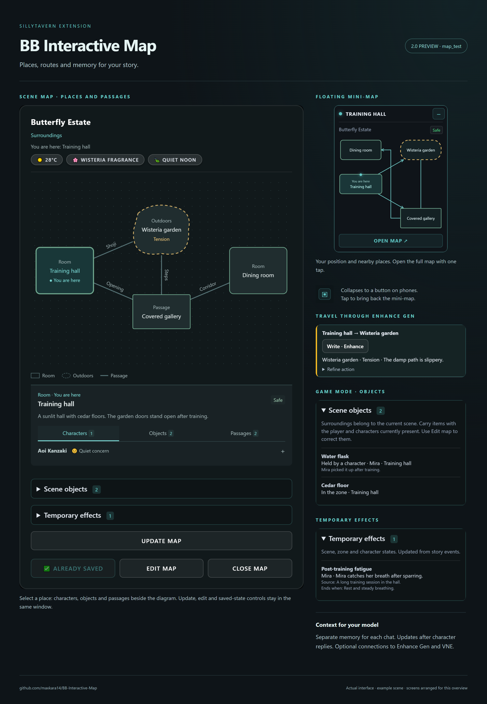

# BB Interactive Map

[Русский](README.md) · **English** · [Changelog](CHANGELOG.md#english)

A **SillyTavern** extension that turns story events into a map of places and passages. Track your position, characters, objects and scene conditions, and give the model spatial memory of the current chat.

**2.0 preview · branch `map_test`**

This branch contains the upcoming 2.0 release. The manifest still reports **1.1.0**; it will change to **2.0.0** when the approved build moves to `main`. The changelog compares this preview with the main version of the map.

Actual extension components with an example scene, arranged for this overview. [Full-size image](docs/images/overview.en.png) · [Russian overview](docs/images/overview.ru.png).

## Features

| Feature | What it does |
|---|---|
| **Places and passages** | Rooms, outdoors, areas and corridors form a schematic with doors, paths, stairs and openings |
| **Floating mini-map** | Shows your position and nearby places, opens the full map and remembers widget position |
| **Scene memory** | Saves a separate map for each chat and supplies it to the model |
| **Updates after character replies** | Prepares a map after a reply or reroll, with review or automatic saving |
| **Review, edit and rollback** | Shows changes, lets you correct the map and restores the previous snapshot |
| **Mention cards** | Highlights map names in messages; clicking opens their description and location |
| **Classic / Game** | Spatial memory, or additional travel drafts, object possession and temporary effects |
| **RU / EN** | Browser language, Russian or English interface; descriptions follow the chat language |
| **Three sources** | Current connection, Connection Manager profile or OpenAI-compatible Custom API |

## Install the preview

1. Open **Extensions → Install extension** in SillyTavern.
2. Paste `https://github.com/maxkara14/BB-Interactive-Map`.
3. Select **`map_test`** in the branch selector in **Manage extensions**. Default installation uses `main`.
4. Reload the page. If the old interface remains, use **Ctrl+F5** on desktop.

Enhance Gen and VNE are optional. Their integrations require compatible versions:

| Extension | Preview branch |
|---|---|
| [BB Enhance Generation](https://github.com/maxkara14/BB-Enhance-Gen) | `codex/map-travel-api` |
| [BB Visual Novel Engine](https://github.com/maxkara14/BB-Visual-Novel-Engine) | `codex/map-context-api` |

## Quick start

1. Open a character or group chat.
2. In **Extension settings → BB Interactive Map**, choose a generation source. The current SillyTavern connection is the default.
3. Under **Current chat map**, choose **Current scene** or **Surroundings**, then **Run new scan**. The floating button also offers the first scan when no map exists.
4. Review the proposal. Use **Edit map** if needed, then save.
5. Open the saved map from the mini-map. **Update map** starts another scan; **Cancel generation** is available in the map and settings during a request. A saved map shows **✅ Already saved**.

The old extension-menu terminal has been replaced by settings and the floating widget.

## Read and edit the map

Place outlines depend on their type. Passage names follow their lines; arrows indicate route direction. Select a place for its description and **Characters**, **Objects** and **Passages** tabs. Expand entries for details; long passage names remain available here when they do not fit on the diagram.

**You are here** marks the known player position. Mini-map status belongs to that place rather than its most dangerous neighbor. Green, amber and red indicate safety, tension and danger. Outdoors have animated dashed outlines; other places keep solid borders and glow for threats. **Map animations** can be disabled, and system reduced-motion settings are respected.

**Edit map** adds or removes places and passages, sets player position, and corrects descriptions, characters, objects and threats. Game mode also edits possession and effects. Edits return to a proposal and are saved when applied. Settings can restore the previous map or clear current memory.

Older 3×3 maps still open in their original format. A saved new scan adopts the new schematic; rollback supports both formats. The diagram represents established connections, not a measured floor plan.

### Desktop and phone

Drag the widget header to move it; its focused header also accepts arrow keys. Position and collapsed state are remembered. On phones the collapsed widget becomes a square button: tap it for the mini-map, then choose **Open map**. Without a map it offers creation. The button can be dragged; the full map scrolls and keeps bottom actions accessible.

## Automatic updates

Enable **Prepare update after reply**. A completed character reply or reroll triggers one map request. Existing memory remains in use while the proposal is prepared.

- By default, the proposal waits for review and saving.
- **Save updates automatically** applies suitable updates immediately and keeps the previous map for rollback.
- Uncertain position, places, passages, possession or effects may require review. An unresolved proposal pauses further automatic requests.

Cancelled responses are discarded. Changing chats prevents a late result from replacing another chat's map. Updates use a separate request and do not create a character reply.

## Classic and Game modes

The mode is saved **per chat**. Both modes include the map, widget, memory, updating, mention cards and safety indicators.

**Classic** keeps spatial memory: places, passages, characters, objects and atmosphere.

**Game** additionally tracks:

- **Scene objects:** location, holder or uncertain whereabouts. Established player possessions follow the player; NPC possessions remain relevant while their holders are present. Old surroundings do not accumulate after scene changes.
- **Temporary effects:** scene, zone or character states with a cause and end condition. Applicable effects persist until story events establish their ending.
- **Travel drafts:** select a place reachable through confirmed passages and prepare an action in the chat input. Sending is manual; the next scan updates position from narrative results.

Switching to Classic hides game panels and instructions while preserving records for switching back.

### Travel through Enhance Gen

Choose **Travel writing → Through Enhance Gen**. Select a destination and optionally refine the action, then **Write · Enhance**. The map closes during generation; Enhance uses its own connection, persona, language, narrative person and Director “Me” token limit.

The result is appended to your draft without sending it. Use Enhance's cancel control beside the chat input during generation and **Restore original** afterwards. Changed drafts, chats or maps prevent stale results from being applied. **Simple text** remains a local template without Enhance or a model request.

## Mention cards

Enable **Highlight map mentions in chat** under **Interface**. Each entity is highlighted once per message: full name, unique first name and surname share one allowance. Supported honorifics and visual spacing such as `ㅤ` do not create duplicates.

Matching is local and does not rewrite messages or request the model. Ambiguous names, code, links and inputs are skipped. Inflections, arbitrary nicknames, transliterations and names split across HTML elements are not matched.

## Context and integrations

Saved memory is injected into the chat model context by default. To place it yourself, enable the macro setting and use **`{{bb_map}}`** in your prompt; automatic injection then stops. The macro is empty when manual placement is disabled.

Enhance and VNE have their own **Use map context** switches, off by default:

- **Enhance:** adds the map to Enhance, Improve, custom writing buttons and Director **To me**.
- **VNE:** adds it to VN response-option generation.

These use the saved map of the active chat. Without a map or with the switch off, generation continues without that additional context. Enhance travel receives map context directly from the map action. Game effects and instructions are included only in Game mode.

## Connections

| Source | Behavior |
|---|---|
| **Current SillyTavern connection** | Active chat model |
| **Connection profile** | Connection Manager profile without switching the active connection |
| **Custom API** | Separate OpenAI-compatible URL, key and model; browser request |

An unavailable profile reports an error. Custom API failures fall back to the current connection; cancellation does not trigger fallback. Scan output allowance is **10,000 tokens**, subject to provider limits. Map quality depends on the model and evidence in recent messages.

## Development and release

[Changelog](CHANGELOG.md#english) · [Roadmap](ROADMAP.md) · [Map format and read-only API](docs/map-format-v3.md) · [Rebuild the overview](docs/overview.md)

The author has confirmed manual testing. This preview awaits final review before merging into `main` and changing the version to 2.0.0.

## Author

[BruniikBron: Lo-Fi & Mods](https://bblofi.online/) · [Telegram](https://t.me/Brun11kBr0n)
