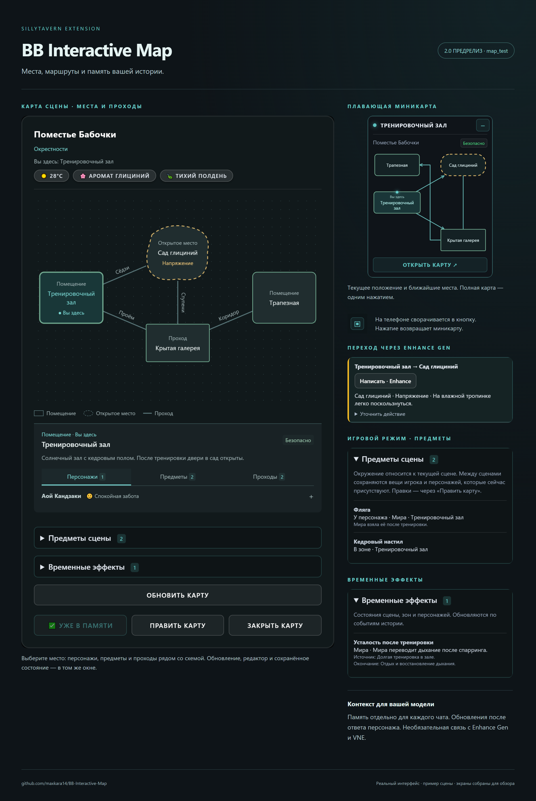

# BB Interactive Map

**Русский** · [English](README.en.md) · [Changelog](CHANGELOG.md#русский)

Расширение **SillyTavern**, которое превращает события истории в карту мест и проходов. Показывает положение игрока, персонажей, предметы и состояния сцены, а сохранённая карта помогает модели учитывать окружение текущего чата.

**Предрелиз 2.0 · ветка `map_test`**

В этой ветке подготовлен будущий выпуск 2.0. В manifest пока остаётся **1.1.0**; версия изменится на **2.0.0** при переносе проверенной сборки в `main`. Changelog описывает изменения относительно основной версии карты.

Действующие компоненты расширения с примером сцены, собранные в обзор. [Полный размер](docs/images/overview.ru.png) · [English overview](docs/images/overview.en.png).

## Возможности

| Возможность | Что делает |
|---|---|
| **Места и проходы** | Помещения, открытые места, участки и коридоры образуют схему с дверями, тропинками, ступенями и проёмами |
| **Плавающая миникарта** | Показывает ваше положение и ближайшие места, открывает полную карту, запоминает положение виджета |
| **Память сцены** | Сохраняет отдельную карту для каждого чата и передаёт её модели |
| **Обновление после ответа чара** | Готовит карту после ответа или перегенерации — с проверкой либо автосохранением |
| **Проверка, редактор и откат** | Показывает изменения, позволяет исправить карту и вернуть предыдущий снимок |
| **Карточки упоминаний** | Подсвечивает названия из карты в сообщениях; по нажатию открывает описание и местоположение |
| **Классический / Игровой** | Пространственная память либо дополнительно переходы, владение предметами и временные эффекты |
| **RU / EN** | Язык браузера, русский или английский интерфейс; описания карты следуют языку чата |
| **Три источника** | Текущее подключение, профиль Connection Manager или OpenAI-compatible Custom API |

## Установка предрелиза

1. Откройте **Расширения → Установить расширение** в SillyTavern.
2. Вставьте `https://github.com/maxkara14/BB-Interactive-Map`.
3. В **Управлении расширениями** выберите ветку **`map_test`** через переключатель веток. По умолчанию устанавливается `main`.
4. Перезагрузите страницу. Если сохранился старый интерфейс, на компьютере нажмите **Ctrl+F5**.

Для собственных функций карты Enhance Gen и VNE не нужны. Необязательные интеграции требуют совместимых версий:

| Расширение | Предрелизная ветка |
|---|---|
| [BB Enhance Generation](https://github.com/maxkara14/BB-Enhance-Gen) | `codex/map-travel-api` |
| [BB Visual Novel Engine](https://github.com/maxkara14/BB-Visual-Novel-Engine) | `codex/map-context-api` |

## Быстрый старт

1. Откройте чат персонажа или группы.
2. В **Настройках расширений → BB Interactive Map** выберите источник генерации. По умолчанию используется текущее подключение SillyTavern.
3. В секции **Карта текущего чата** выберите **Текущая сцена** или **Окрестности** и нажмите **Запустить новый скан**. Плавающая кнопка также предлагает первый скан, если карты ещё нет.
4. Проверьте предложение. При необходимости откройте **Править карту**, затем сохраните.
5. Открывайте сохранённую карту из миникарты. **Обновить карту** запускает следующий скан; во время запроса в карте и настройках доступна **Отменить генерацию**. У сохранённой карты кнопка показывает **✅ Уже в памяти**.

Прежний терминал в меню расширений заменён настройками и плавающим виджетом.

## Просмотр и редактирование

Форма места зависит от его типа. Названия проходов расположены вдоль линий, стрелки показывают направление маршрута. Выберите место, чтобы открыть описание и вкладки **Персонажи**, **Предметы**, **Проходы**. Элементы раскрываются для подробностей; длинные названия проходов доступны здесь, даже если не помещаются на схеме.

Отметка **Вы здесь** показывает известное положение игрока. Статус миникарты относится к этому месту, а не к самой опасной соседней зоне. Зелёный, жёлтый и красный обозначают безопасность, напряжение и опасность. У открытых мест анимированная пунктирная обводка; остальные сохраняют сплошную границу и подсвечиваются при угрозе. **Анимации карты** можно отключить; системное уменьшение движения учитывается.

Через **Править карту** можно добавлять и удалять места и проходы, задавать положение игрока, исправлять описания, персонажей, предметы и угрозы. В игровом режиме доступны владение предметами и эффекты. Правки возвращаются в предложение и сохраняются после применения. В настройках можно восстановить предыдущую карту или очистить текущую память.

Старые карты 3×3 открываются в исходном формате. Новая схема появляется после сохранения нового скана; откат поддерживает оба формата. Схема отражает установленные связи, а не точный план помещения.

### Компьютер и телефон

Перетаскивайте виджет за заголовок; при фокусе на заголовке можно использовать стрелки клавиатуры. Положение и свёрнутое состояние запоминаются. На телефоне свёрнутый виджет становится квадратной кнопкой: нажмите её для миникарты, затем **Открыть карту**. Без карты кнопка предлагает создать её. Кнопка перетаскивается; полная карта прокручивается и сохраняет доступ к нижним действиям.

## Автоматическое обновление

Включите **Готовить обновление после реплики**. Завершённый ответ персонажа или его перегенерация запускают один запрос карты. Пока готовится предложение, используется прежняя память.

- По умолчанию предложение ждёт проверки и сохранения.
- **Сохранять обновление автоматически** применяет подходящие обновления сразу, оставляя предыдущую карту для отката.
- Неоднозначное положение, места, проходы, владение предметами или эффекты могут потребовать проверки. Нерассмотренное предложение приостанавливает новые автоматические запросы.

Отменённый ответ отбрасывается. Смена чата не позволяет позднему результату заменить чужую карту. Обновление использует отдельный запрос и не создаёт ответ персонажа.

## Классический и игровой режимы

Режим сохраняется **для каждого чата**. В обоих доступны карта, виджет, память, обновления, карточки упоминаний и обозначения безопасности.

**Классический** хранит пространственную память: места, проходы, персонажей, предметы и атмосферу.

**Игровой** дополнительно отслеживает:

- **Предметы сцены:** положение, владельца или неизвестное местонахождение. Подтверждённые вещи игрока переходят с ним; вещи NPC актуальны, пока владельцы присутствуют. Старое окружение не накапливается после смены сцены.
- **Временные эффекты:** состояния сцены, зоны или персонажа с причиной и условием окончания. Актуальные эффекты сохраняются до установленных историей событий завершения.
- **Переходы:** выберите место, доступное через подтверждённые проходы, и подготовьте действие в поле ввода. Отправка ручная; следующий скан обновляет положение по результату событий.

Возврат в классику скрывает игровые панели и инструкции, сохраняя записи для обратного переключения.

### Переходы через Enhance Gen

Выберите **Подготовка перехода → Через Enhance Gen**. Укажите место назначения и при желании уточните действие, затем нажмите **Написать · Enhance**. Карта закрывается на время генерации; Enhance использует своё подключение, персону, язык, лицо повествования и лимит Director «Мне».

Результат добавляется к черновику без отправки. Во время генерации используйте отмену Enhance рядом с полем чата, после — **Вернуть оригинал**. Изменение черновика, чата или карты защищает от устаревшего ответа. **Простой текст** остаётся локальным шаблоном без Enhance и запроса к модели.

## Карточки упоминаний

Включите **Подсвечивать упоминания карты в чате** в секции **Интерфейс**. Каждая сущность подсвечивается один раз в сообщении: полное имя, уникальные имя и фамилия используют одну общую подсветку. Поддерживаемые обращения и визуальные разделители вроде `ㅤ` не создают повторов.

Поиск локальный, не переписывает сообщения и не запрашивает модель. Неоднозначные имена, код, ссылки и поля ввода пропускаются. Склонения, произвольные прозвища, транслитерации и имена, разделённые HTML-элементами, не сопоставляются.

## Контекст и интеграции

По умолчанию память автоматически передаётся модели чата. Для собственного размещения включите настройку макроса и используйте **`{{bb_map}}`** в промпте — автоматическая вставка прекращается. При выключенном ручном размещении макрос пуст.

В Enhance и VNE есть собственные переключатели **Использовать контекст карты**, по умолчанию выключенные:

- **Enhance:** добавляет карту в Enhance, Improve, свои кнопки обработки текста и Director **Мне**.
- **VNE:** добавляет её в генерацию вариантов VN-ответа.

Используется сохранённая карта активного чата. Без карты или с выключенной настройкой генерация продолжается без этого дополнительного контекста. Переход через Enhance получает карту непосредственно из действия на карте. Игровые эффекты и инструкции включаются только в игровом режиме.

## Подключения

| Источник | Поведение |
|---|---|
| **Текущее подключение SillyTavern** | Активная модель чата |
| **Профиль подключения** | Профиль Connection Manager без переключения активного подключения |
| **Custom API** | Отдельные OpenAI-compatible URL, ключ и модель; запрос из браузера |

Недоступный профиль сообщает об ошибке. При ошибке Custom API используется текущее подключение; отмена не запускает запасной запрос. Лимит ответа скана — **10 000 токенов**, но провайдер может устанавливать свои ограничения. Качество карты зависит от модели и фактов в последних сообщениях.

## Разработка и выпуск

[Changelog](CHANGELOG.md#русский) · [План](ROADMAP.md) · [Формат карты и API чтения](docs/map-format-v3.md) · [Пересборка обзора](docs/overview.md)

Автор подтвердил завершение ручных проверок. Предрелиз ожидает финального просмотра перед переносом в `main` и изменением версии на 2.0.0.

## Автор

[BruniikBron: Lo-Fi & Mods](https://bblofi.online/) · [Telegram](https://t.me/Brun11kBr0n)
